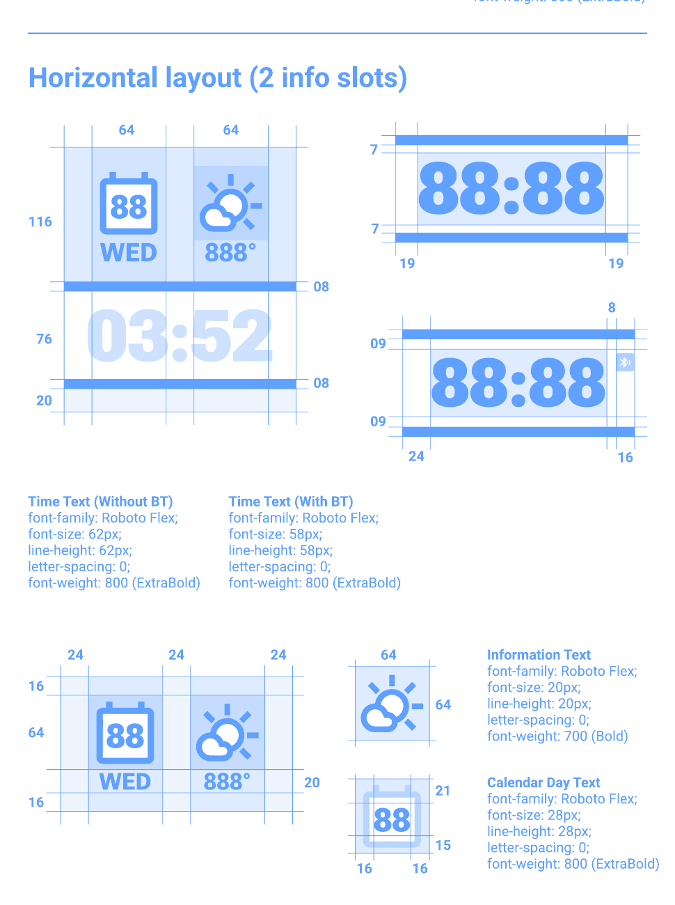

# Horizontal Two-Slot Layout

Status: **approved and geometry locked**

- Lock revision: `1`
- Approved: August 17, 2026
- Approved stress overlay:
  [`qa/goldens/horizontal_2/approved-stress-overlay.png`](../qa/goldens/horizontal_2/approved-stress-overlay.png)

Geometry reference: Redux Racer, Figma node `295:4551` (`yellow_template`)

Typography and corrected 228 px geometry: `Build Specifications.pdf`, section
`Horizontal layout (2 info slots)`. The build specification supersedes the
legacy Figma frame's Teko labels/time and its extra 229th canvas row.

## Canvas structure

| Region | X | Y | Width | Height |
| --- | ---: | ---: | ---: | ---: |
| Informational tray | 0 | 0 | 200 | 116 |
| Top divider | 0 | 116 | 200 | 8 |
| Time panel | 0 | 124 | 200 | 76 |
| Bottom divider | 0 | 200 | 200 | 8 |
| Reserved bottom strip | 0 | 208 | 200 | 20 |

These regions fill the native 200 × 228 px Emery canvas exactly.

The reserved strip now hosts the shared
[`Battery Indicator`](battery-indicator.md). This is a styling addition inside
the locked region and does not change the two-slot geometry contract.

## Informational tray

- Background: `#00AAFF`
- Horizontal spacing: 24 px outer padding and 24 px between icons
- Icon canvas: 64 × 64 px
- Icon positions: `x=24, y=16` and `x=112, y=16`
- Figma value frame: y=80, height=20 px
- Approved Pebble value frame: y=78, height=20 px
- Typeface: Roboto Flex Bold, 20 px / 20 px
- Value alignment: centered
- Text color: black

The QA slots use Calendar (`30`, `Mer`) and Weather (`888°`).

### Calendar day

- Typeface: Roboto Flex ExtraBold, 28 px / 28 px
- Figma icon-local frame: `x=16, y=21, w=32, h=28`
- Approved Pebble icon-local frame: `x=16, y=17, w=32, h=28`
- Alignment: centered

As with the approved three-slot layouts, the custom layer draws the reusable
blank calendar bitmap first and the day number second.

## Time panel

- Background: white
- Typeface: Roboto Flex ExtraBold
- Font size and line height: 62 px
- Alignment: centered
- Figma text frame: `x=19, y=131, w=162, h=62`
- Pebble input frame: `x=0, y=120, w=200, h=64`
- Stress value: `23:59`

The runtime frame reuses the approved `horizontal_3` renderer compensation.
The transparent full-panel width prevents Pebble from ellipsizing the stress
value while preserving its visible centered position.

## QA scope

The horizontal two-slot geometry is locked. Live time, weather, calendar,
battery, health, localization, theme, Bluetooth, and configuration logic may be
connected without changing the approved frames.

Any coordinate, dimension, font size, icon canvas, or panel geometry change
must:

1. Increment `TWO_SLOT_LAYOUT_LOCK_REVISION`.
2. Update `tests/validate_two_slot_layout.py`.
3. Pass a Pebble Time 2 emulator build.
4. Receive a new emulator/Figma overlay approval.
