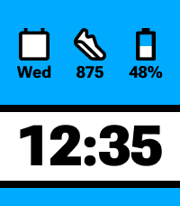

# Horizontal Three-Slot Layout

Status: first static pixel-QA build

Figma source: Redux Racer, node `334:8203` (`Calendar + Steps + Battery`)

## Canvas structure

| Region | X | Y | Width | Height |
| --- | ---: | ---: | ---: | ---: |
| Informational tray | 0 | 0 | 200 | 116 |
| Top divider | 0 | 116 | 200 | 8 |
| Time panel | 0 | 124 | 200 | 76 |
| Bottom divider | 0 | 200 | 200 | 8 |
| Reserved bottom strip | 0 | 208 | 200 | 20 |

The five regions fill the 200 × 228 px Emery canvas exactly. The bottom strip
inherits the tray color while the battery indicator is disabled.

## Informational tray

- Background: `#00AAFF`
- Horizontal padding: 12 px
- Vertical padding: 27 px
- Gap between slot groups: 10 px
- Icon canvas: 52 × 44 px
- Value typeface: Roboto Flex ExtraBold, 18 px / 18 px
- Value alignment: centered
- Text color: black

| Slot | X | Figma icon Y | Pebble icon Y | Figma value Y | Pebble value Y | QA value |
| --- | ---: | ---: | ---: | ---: | ---: | --- |
| Calendar | 12 | 27 | 28 | 71 | 69 | `Mer` |
| Steps | 74 | 27 | 27 | 71 | 69 | `99999` |
| Battery | 136 | 27 | 27 | 71 | 69 | `100%` |

The calendar uses the same custom bitmap-then-text drawing pattern as the
approved vertical layout. The day `30` is rendered in the local frame
`x=10, y=13, w=32, h=18`.

## Time panel

- Background: white
- Figma horizontal padding: 19 px
- Figma vertical padding: 7 px
- Typeface: Roboto Flex ExtraBold
- Font size and line height: 62 px
- Alignment: centered
- Figma text frame: `x=19, y=131, w=162, h=62`
- Initial Pebble input frame: `x=19, y=123, w=162, h=64`
- Stress value: `23:59`

The static 62 px font measures `23:59` at approximately 161.54 px, leaving
0.46 px inside the 162 px usable width. The initial Pebble frame compensates
for custom-font baseline metrics and must be confirmed with an emulator/Figma
overlay before this layout is locked.

## QA scope

This build intentionally uses static worst-case values. Approve the geometry
with a Pebble Time 2 emulator overlay before connecting live data, configuration,
themes, or the optional bottom battery indicator.
