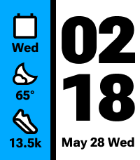

# Vertical Three-Slot Layout

Status: first static pixel-QA build

Figma source: Redux Racer, node `334:8183` (`Calendar + Weather + Steps`)

## Canvas structure

| Region | X | Y | Width | Height |
| --- | ---: | ---: | ---: | ---: |
| Informational tray | 0 | 0 | 72 | 228 |
| Vertical divider | 72 | 0 | 8 | 228 |
| Time panel | 80 | 0 | 120 | 228 |

The three regions fill the 200 × 228 px Emery canvas exactly.

## Informational tray

- Background: `#00AAFF`
- Horizontal padding: 10 px
- Nominal vertical padding: 16 px
- Gap between slot groups: 6 px
- Icon canvas: 52 × 44 px
- Value typeface: Roboto Flex ExtraBold, 18 px / 18 px
- Value alignment: centered
- Text color: black

Each icon/value group is 62 px tall. The combined 198 px stack is centered in the tray's 196 px padded content area. Pebble's bitmap and custom-font renderers require small input-frame offsets to reproduce the Figma visible-pixel positions:

| Slot | Figma icon Y | Pebble icon Y | Figma value Y | Pebble value Y | QA value |
| --- | ---: | ---: | ---: | ---: | --- |
| 1 | 15 | 16 | 59 | 57 | `Wed` |
| 2 | 83 | 84 | 127 | 125 | `65°` |
| 3 | 151 | 152 | 195 | 193 | `13.5k` |

## Divider

- Width: 8 px
- Height: 228 px
- Color: black

## Time panel

- Background: white
- Horizontal padding: 6 px
- Vertical padding: 16 px
- Usable text width: 108 px
- Time/date group gap: 16 px
- Text color: black

### Time

- Typeface: Roboto Flex ExtraBold
- Font size: 93 px
- Line height: 76 px
- Gap between hour and minute lines: 6 px
- Alignment: right
- Figma hour frame: `x=86, y=20, w=108, h=76`
- Figma minute frame: `x=86, y=102, w=108, h=76`
- Pebble hour input frame: `x=86, y=-2, w=108, h=94`
- Pebble minute input frame: `x=86, y=80, w=108, h=94`

Pebble positions the 93 px custom-font glyphs 25 px below the text-layer origin. The expanded transparent layers prevent the lower portion of each numeral from being clipped while preserving the Figma visible-pixel positions.

### Date

- Typeface: Roboto Flex ExtraBold
- Font size and line height: 18 px
- Alignment: centered
- Figma frame: `x=86, y=194, w=108, h=18`
- Pebble input frame: `x=86, y=192, w=108, h=18`
- Figma QA value: `May 28 Wed`

Localization stress-test value: `Sept 30 Mer`. Do not add punctuation to this
format. In the pinned Roboto Flex ExtraBold 18 px font it measures approximately
101.79 px, leaving 6.21 px inside the 108 px usable date width.

## QA scope

This build intentionally uses static Figma values. Approve the geometry with a Pebble Time 2 emulator overlay before connecting live time, date, weather, health, battery, localization, theme, or configuration logic.
